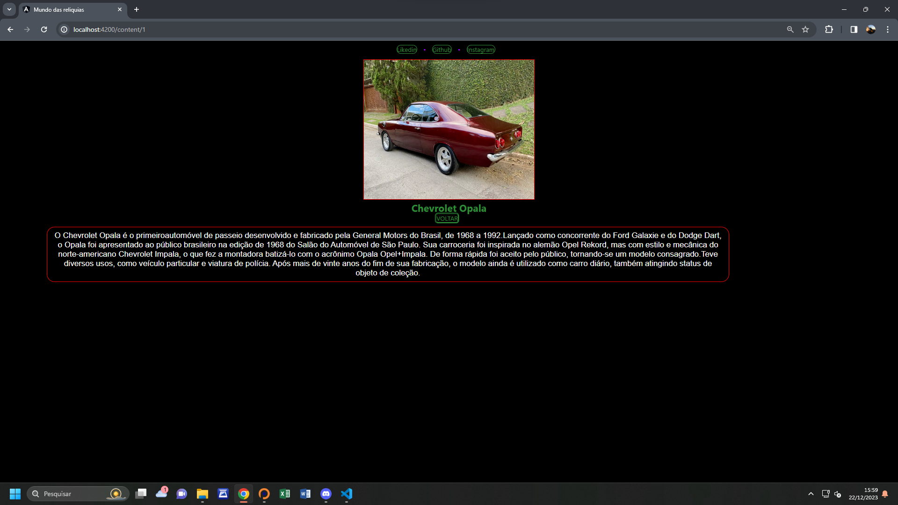

# Blog-Project

This project was generated with [Angular CLI](https://github.com/angular/angular-cli) version 14.1.2.

- Clone o repositório
git clone https://github.com/ThiagoMts100/Blog-Project.git

- Entre no arquivo do projeto
cd Blog-project

- Instale as dependências
npm install

- Inicie o projeto 
ng serve

Fase de desenvolvimento com alguns detalhes a serem revistos.
